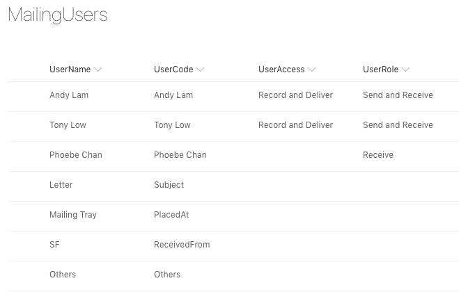
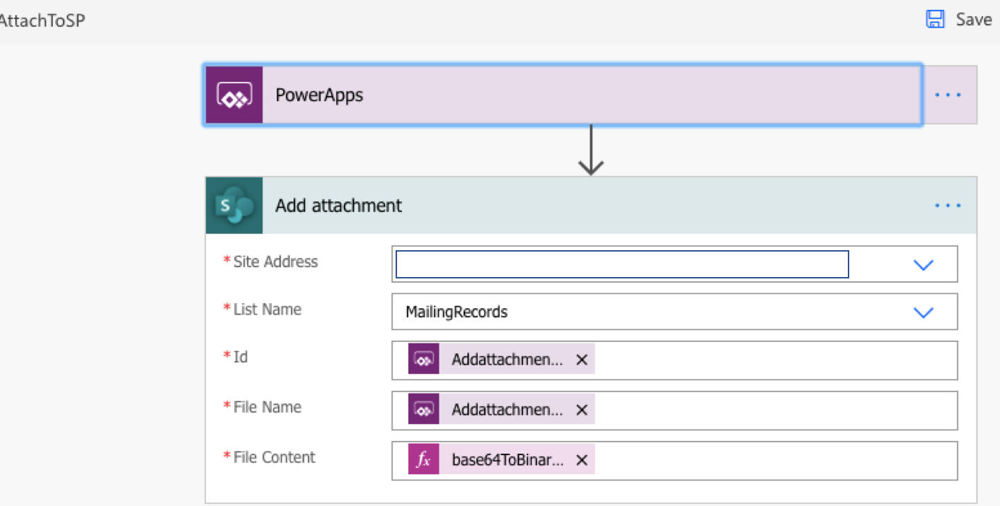
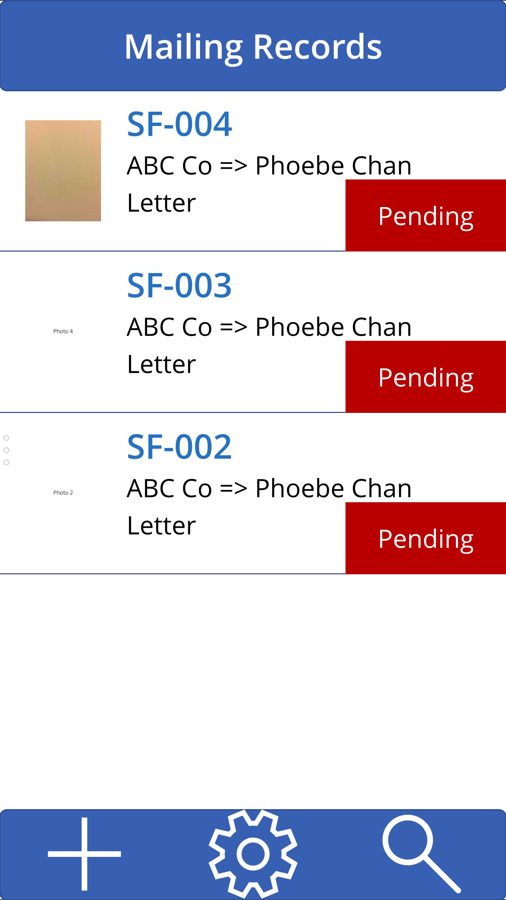
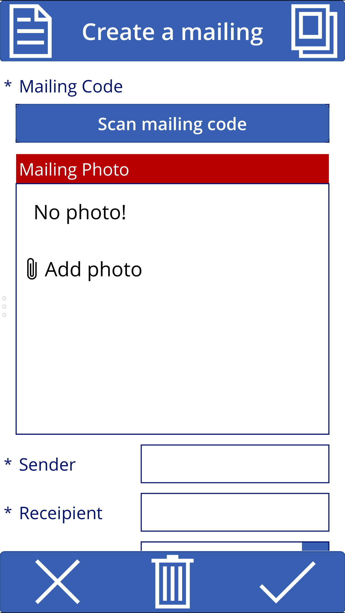
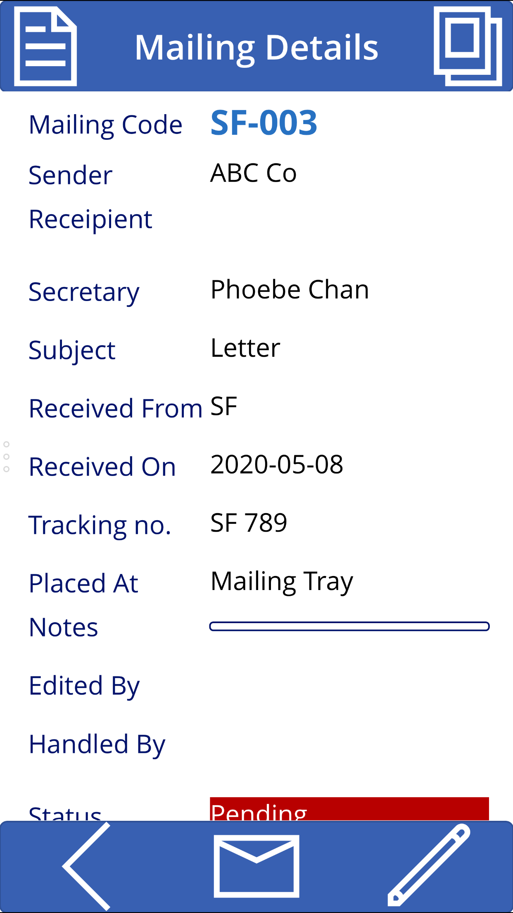
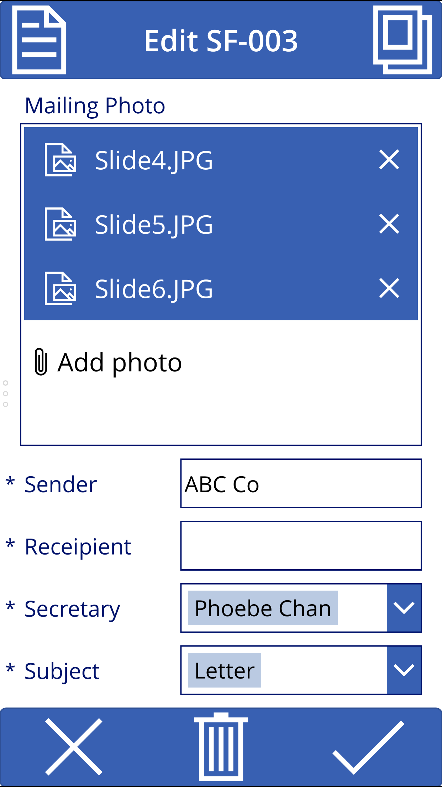
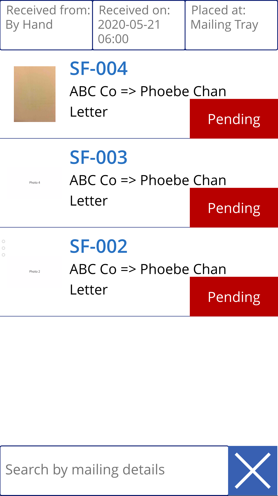
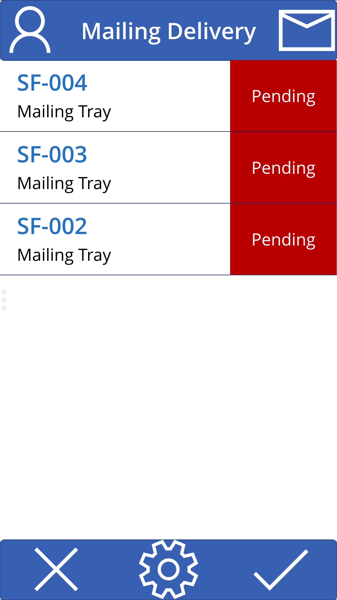

<h1>Mailing app</h1>
<h2>Microsoft PowerApps</h2>
<h3>Open <a href='MailingApp.msapp'>MailingApp.msapp</a> in PowerApps Studio</h3>

<h2>Microsoft SharePoint</h2>
<h3>Create "MailingRecords" and "MailingUsers" as SharePoint lists</h3>

  

    
Columns of "MailingRecords"

    <table>
     <tbody>
       <tr><td>MailingCode</td><td>Single line of text</td></tr>
       <tr><td>From</td><td>Single line of text</td></tr>
       <tr><td>To</td><td>Single line of text</td></tr>
       <tr><td>Attention</td><td>Single line of text</td></tr>
       <tr><td>Subject</td><td>Single line of text</td></tr>
       <tr><td>ReceivedFrom</td><td>Single line of text</td></tr>
       <tr><td>ReceivedOn</td><td>Single line of text</td></tr>
       <tr><td>TrackingNo</td><td>Single line of text</td></tr>
       <tr><td>PlacedAt</td><td>Single line of text</td></tr>
       <tr><td>Notes</td><td>Multiple lines of text</td></tr>
       <tr><td>EditedBy</td><td>Multiple lines of text</td></tr>
       <tr><td>EditedOn</td><td>Multiple lines of text</td></tr>
       <tr><td>HandledBy</td><td>Multiple lines of text</td></tr>
       <tr><td>HandledOn</td><td>Multiple lines of text</td></tr>
       <tr><td>Status</td><td>Single line of text</td></tr>
     </tbody>
    </table>
  

  

   
Columns of "MailingUsers"

   <table>
     <tbody>
       <tr><td>UserName</td><td>Single line of text</td></tr>
       <tr><td>UserCode</td><td>Single line of text</td></tr>
       <tr><td>UserAccess</td><td>Single line of text</td></tr>
       <tr><td>UserRole</td><td>Single line of text</td></tr>
     </tbody>
   </table>
  

  
  

<h2>Microsoft Flow</h2>
<h3>Create "AttachToSP" in Flow</h3>

<h2>Preview</h2>
<table>
  <tbody>
    <tr><td></td><td></td><td></td></tr>
    <tr><td></td><td></td><td></td></tr>
    <tr><td></td><td></td><td></td></tr>
  </tbody>
</table>
